# soal-shift-sisop-modul-4-B09-2021

* Vincent Yonathan    - 05111940000186
* Aprilia Annisa      - 05111940000199
* Pramudityo Prabowo  - 05111940000210
---
### Soal Modul 3
[Soal Shift Modul 4](https://docs.google.com/document/d/1KlAG2thAMm42so8BZMylw216EETVGu_DAM5PfwJzl5U/edit)

---

### Daftar isi
* [Soal 1](#soal-1)
* [Soal 2](#soal-2)
* [Soal 3](#soal-3)
* [Soal 4](#soal-4)

---
### Soal 1
*Praktikan* diminta membantu mengerjakan pembuatan filesystem dengan metode enkripsi (encode).
#### 1.a)
*Praktikan* diminta untuk membuat filesystem dimana bisa dilakukan mkdir(pembuatan folder) dimana jika itu dilakukan dan namanya diawali dengan "AtoZ_", maka nama folder beserta seluruh isinya akan terenkripsi dengan metode Atbash Cipher.
#### Source Code & Penjelasan
---
```c
...
void atcip(char* temp)
{
	int i = 0;

    while (temp[i] != '\0')
    {
        if(temp[i] >= 'A' && temp[i] <= 'Z')
        {
            temp[i] = 'Z'+'A' - temp[i]; 
        }
        else if(temp[i] >= 'a' && temp[i] <= 'z')
        {
            temp[i] = 'z'+'a' - temp[i];
        }
        i++;
    }
//    for(j=0;j<strlen(temp);j++)
//    {
//    	printf("%c",temp[j]);	
//	}
    // char* ret = malloc(sizeof(char) * 1000) ;
    // strcpy(ret,temp);
    // return ret;
}
    
char* polapath(char* path)
{
 
    char *fpath = malloc(sizeof(char) * 1000);
    char real_path[1000];
    strcpy(real_path, path);

    char *str = strstr(real_path, "/AtoZ_");

    if (str)
    {
        tempchiper = 1;
        int index = strlen(real_path) - strlen(str) + 1;
        while (index < strlen(real_path))
        {
            if (real_path[index] == '/')
            {
                printf("ini index --> %d\n ",index);
                atcip(&real_path[index]);
                char dirp_temp[1000];
                sprintf(dirp_temp, "%s%s", dirp, real_path);
                // printf("Ini folder dengan path --> %s\n",dirp_temp);
                DIR* dp = opendir(dirp_temp);
                if(dp)
                {
                    break;
                }
                else
                {
                    char* file = strrchr(real_path,'/')+1;
                    char* extensi = strchr(file,'.');
                    printf("Ini file--> %s%s\n",real_path,file);
                    if(extensi)
                    {
                        extensi += 1;
                        atcip(extensi);
                
                    }
                    break;
                }
                closedir(dp);
            }
            index++;
        }
        sprintf(fpath, "%s%s", dirp, real_path);
    }
    else
    {
        sprintf(fpath, "%s%s", dirp, real_path);
    }
    
    return fpath;
}    
...
```
Fungsi utama dari soal ini adalah 2 fungsi diatas yaitu polapath() dan atcip()
- Fungsi atcip() diatas merupakan kode yang digunakan untuk melakukan Atbash Cipher yaitu dengan melakukan *mirror* kepada masing - masing `char`. Cara melakukannya adalah looping dari setiap `char` dari kalimat kemudian apabila `char` tersebut ada dalam range A sampai Z atau a sampai z, maka akan char itu akan dikurangkan dengan ('Z'+'A') atau ('z' + 'a')
- Fungsi polapath() berguna sebagai fungsi yang memfilter apakah path tersebut memiliki string "/AtoZ_" didalamnya. Apabila ada, maka akan dicek dengan opendir apakah berupa folder, apabila bukan maka akan dianggap file. File pun terbagi jadi 2 yaitu dengan extension atau tidak. Apabila dengan extension, maka akan ada variable yang mengambil extentiom tersebut yang nantinya akan digunakan pada xmp_readdir. Terakhir adalah menggunakan `sprintf` untuk menghasilkan path yang sudah benar dan terenkripsi.

```c
...
static  int  xmp_getattr(const char *path, struct stat *stbuf)
{
    // printf("GETATTR PATH--> %s\n",path);
    char fpath[BUFSIZ];
    char tempp[BUFSIZ];
    strcpy(tempp,path);
    strcpy(fpath,polapath(tempp));
    int res;
    res = lstat(fpath, stbuf);

    if (res == -1) return -errno;
    return 0;
}
static int xmp_readdir(const char *path, void *buf, fuse_fill_dir_t filler, off_t offset, struct fuse_file_info *fi)
{
    // printf("READDIR PATH--> %s\n",path);
    DIR *dp;
    int res;
    char tempp[BUFSIZ];
    tempchiper = 0;
    struct dirent *de;
    (void) offset;
    (void) fi;

    strcpy(tempp,path);
    dp = opendir(polapath(tempp));

    if (dp == NULL) return -errno;

    while ((de = readdir(dp)) != NULL) {
        struct stat st;
        char temp[BUFSIZ];

        memset(&st, 0, sizeof(st));

        st.st_ino = de->d_ino;
        st.st_mode = de->d_type << 12;
        
        if(strcmp (de->d_name,".")==0|| strcmp(de->d_name,"..") == 0)
        {
            res = filler(buf,de->d_name,&st,0);
        }
        else if(tempchiper == 1)
        {
            if(de->d_type & DT_DIR)
            {
                printf("Ini folder --> %s\n",de->d_name);
                clear(temp);
                strcpy(temp,de->d_name);
                atcip(temp);
                res = (filler(buf, temp, &st, 0));
            }
            else
            {
                char* ext = strchr(de->d_name,'.');

                char fname[BUFSIZ];
                bzero(fname,BUFSIZ);
                if(ext)
                {
                    printf("Ini file dengan ext --> %s\n",de->d_name);
                    strncpy(fname,de->d_name, strlen(de->d_name) - strlen(ext));
                    atcip(fname);
                    strcat(fname,ext);
                }
                else
                {
                    printf("File without extention --> %s\n",de->d_name);
                    strcpy(fname,de->d_name);
                    atcip(fname);
                }

                res = (filler(buf, fname, &st, 0));
            }
        }
        else
        {
            strcpy(temp,de->d_name);
            res = filler(buf, temp, &st, 0);
        }

        if(res != 0) 
        {
            break;
        }
    }
    closedir(dp);
    return 0;
}

static int xmp_mkdir(const char *path, mode_t mode)
{
   
    char temppath[BUFSIZ];
    char tempp[BUFSIZ];
    char tempp2[BUFSIZ];
    strcpy(tempp,path);
    strcpy(tempp2,dirp);

    strcat(tempp2,tempp);
    strcpy(temppath,tempp2);

    rlog("none",temppath,0);

    char fullpath[BUFSIZ];
    int res;
    clear(fullpath);
    strcpy(fullpath, polapath(tempp));

	res = mkdir(fullpath, mode);
	if (res == -1)
		return -errno;

	return 0;

}
...
```
Berikut adalah 3 fungsi yang digunakan untuk mkdir (membuat folder) yaitu xmp_readdir, xmp_getattr dan xmp_mkdir: 
- Sesuai dengan namanya fungsi xmp_mkdir digunakan untuk membuat folder atau direktori baru dengan cara mengassign `path` ke suatu variable kemudian di gabungkan (strcat) dengan folder yang menampung direktori penuh yang dideclare pada global (home/prk/Downloads) agar kedua folder dapat terhubung. Terakhir menggunakan `res` untuk `mkdir` atau membuat folder dengan parameter `fullpath` dan `mode`.
- Fungsi kedua adalah xmp_getattr yang berfungsi untuk mendapatkan attribut `path` dimana kita berada dan fungsi ini cukup sederhana yaitu mengassign path ke suatu variable dan memanggil fungsi polapath() yaitu fungsi yang menghandle apabila file tersebut harus dienkripsi ataupun tidak dan akhirnya menggunakan `res` untuk mengirim dengan syntax `res = lstat(fpath, stbuf);`
- Fungsi ketiga adalah xmp_readdir dimana fungsi ini menghandle pemisahan antara folder dengan file. Seperti yang dilihat bahwa terdapat `tempchiper` yang merupakan variable penyimpan apakah fungsi ini harus dienrkipsi, variable ini diletakkan dalam scope global. Apabila readdir mendapatkan bahwa file harus dienkripsi, fungsi ini akan melewati kondisi apabila fungsi tersebut merupakan folder ataupun file. Apabila folder maka akan di enkripsi dan dikirim dengan `res = (filler(buf, temp, &st, 0));`. Apabila file maka akan dibedakan lagi menjadi 2 yaitu dengan extensi ataupun tidak. Apabila dengan ekstensi, pada akhir akan digabung lagi dengan extensinya yang disimpan dalam variable menggunakan syntax `strcat`, setelah itu dienkripsi baru dikirim dengan `res = (filler(buf, temp, &st, 0));`. Apabila tanpa ekstensi, maka akan langsung dienkripsi dan dikirim.

#### Output :
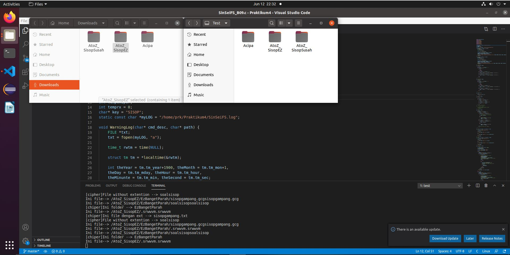

---

#### 1.b)
*Praktikan* diminta untuk membuat filesystem dimana bisa dilakukan rename(perubahan nama folder) dimana jika itu dilakukan dan namanya diawali dengan "AtoZ_", maka nama folder beserta seluruh isinya akan terenkripsi dengan metode Atbash Cipher.
##### Source Code & Penjelasan
---
```c
...
static int xmp_rename(const char *lama, const char *baru)
{
    char tempsebelum[BUFSIZ];
    char tempsetelah[BUFSIZ];
    clear(tempsebelum);
    clear(tempsetelah);
    sprintf(tempsebelum, "%s%s", dirp, lama);
    sprintf(tempsetelah, "%s%s", dirp, baru);

    rlog(tempsebelum,tempsetelah,1);

	int res;

	res = rename(tempsebelum, tempsetelah);
	if (res == -1)
		return -errno;

	return 0;
}
...
```
- Fungsi - fungsi sebelumnya seperti xmp_getattr(), xmp_readdir(), polapath() serta atcip() tetap digunakan.
- xmp_rename ini digunakan ketika *user* ingin melakukan rename (mengganti nama folder). Caranya cukup sederhana yaitu menyimpan nama file sebelum dan sesudah ke dalam variable.
- Setelah itu melakukan `sprintf`, pada kedua variable dengan tujuan mendapatkan path full dari keduanya.
- Setelah itu hanya tinggal menggunakan `res` untuk memanggil rename dengan parameter `tempsebelum` yang diganti dengan `tempsetelah`.
- Maka program akan berjalan dan mengganti nama folder yang dituju kemudian mengecek untuk melakukan enkripsi Atbash Cipher.

#### Output :
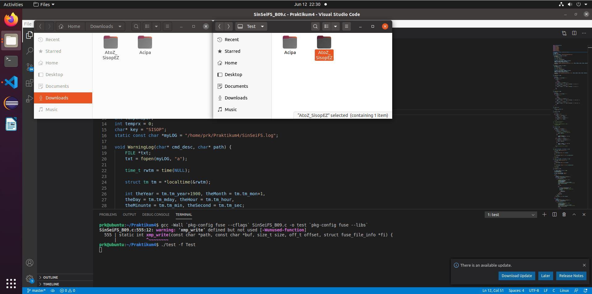
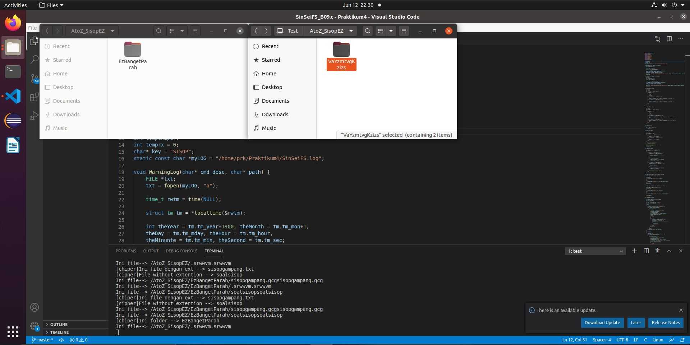
---

#### 1.c)
*Praktikan* diminta untuk membuat filesystem dimana bisa dilakukan rename(perubahan nama folder) dimana apabila direktori yang terenkripsi di-rename menjadi tidak ter-encode, maka isi direktori tersebut akan terdecode.
#### Source Code & Penjelasan
---
```c
...
static int xmp_rename(const char *lama, const char *baru)
{
    char tempsebelum[BUFSIZ];
    char tempsetelah[BUFSIZ];
    clear(tempsebelum);
    clear(tempsetelah);
    sprintf(tempsebelum, "%s%s", dirp, lama);
    sprintf(tempsetelah, "%s%s", dirp, baru);

    rlog(tempsebelum,tempsetelah,1);

	int res;

	res = rename(tempsebelum, tempsetelah);
	if (res == -1)
		return -errno;

	return 0;
}
...
```
- Pada fungsi rename seperti pada 1.b), itu juga akan berjalan ketika folder direname menjadi nama yang tidak ter-encode atau terenkripsi, fungsinya telah mampu menghandle kejadian tersebut. Hal ini terjadi karena pada dasarnya Atbash Cipher merupakan pencerminan daripada string. Maka cukup menggunakan algoritma yang telah dijelaskan pada 1.b) pada soal ini. Contoh "AtoZ_APA KABAR" di enkripsi menggunakan Atbash Cipher menjadi "ZKZ PZYZI", begitu pula "ZKZ PZYZI" di atbash menjadi "APA KABAR".
 
#### Output :
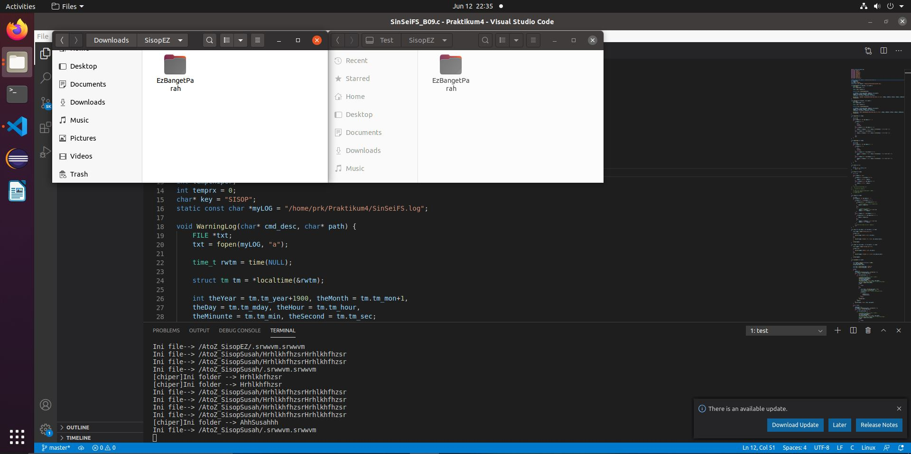
---

#### 1.d)
*Praktikan* diminta untuk membuat filesystem dimana bisa setiap pembuatan direktori ter-encode (mkdir atau rename) akan tercatat ke sebuah log. Format : /home/USER/Downloads/Nama Direktori → /home/USER/Downloads/AtoZ_Nama Direktori

#### Source Code & Penjelasan
---
```c
...

void rlog (char dir_lama[], char dir_baru[], int tipe)
{
    FILE* logge = fopen("running.log","a");

    if(tipe == 0)
    {
        fprintf(logge,"[mkdir]: %s\n", dir_baru);
    }
    else
    {
        fprintf(logge,"[rename]: %s -> %s\n", dir_lama,dir_baru);
    }

    fclose(logge);
}
...
```
- Pada soal ini, diminta membuat log untuk setiap mkdir(pembuatan folder) dan rename(penggantian nama folder). Caranya adalah dengan menambahkan fungsi rlog() dimana tujuan dari fungsi ini adalah membuka file `running.log` ( membuatnya ketika belum ada ) pada path dimana dia akan diletakkan
- Setelah itu ketika pada source code fungsi xmp_mkdir dan xmp_rename diatas, dapat dilihat bahwa ditambahkan rlog() dengan parameter nama filenya serta modenya. Disini, ditentukan bahwa mode `0` berarti mkdir dan mode `1` berarti rename, sehingga nantinya dapat dihandle oleh rlog ketika diketahui modenya. Apabila modenya `0` maka akan dilakukan `fprintf(logge,"[mkdir]: %s\n", dir_baru);`, apabila mode `1` maka akan menjadi `fprintf(logge,"[rename]: %s -> %s\n", dir_lama,dir_baru);`.
- Terakhir adalah menutup file dengan `fclose`.
#### Output :
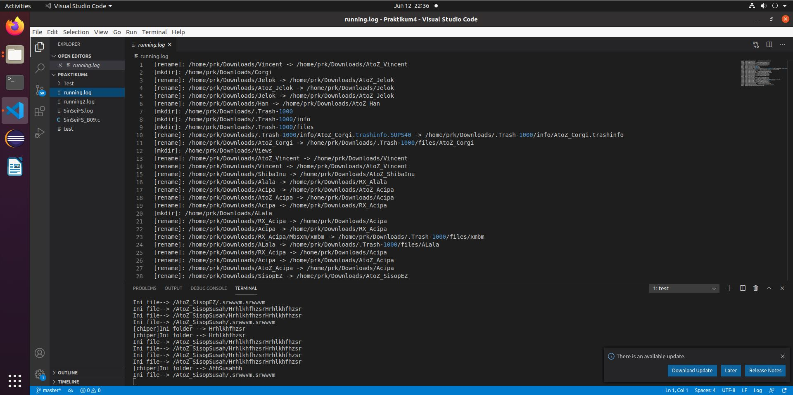
---
#### 1.e)
*Praktikan* diminta untuk membuat filesystem dimana metode encode pada suatu direktori juga berlaku terhadap direktori yang ada di dalamnya.(rekursif)

#### Source Code & Penjelasan
---
```c
char* polapath(char* path)
{
 
    char *fpath = malloc(sizeof(char) * 1000);
    char real_path[1000];
    strcpy(real_path, path);

    char *str = strstr(real_path, "/AtoZ_");

    if (str)
    {
        tempchiper = 1;
        int index = strlen(real_path) - strlen(str) + 1;
        while (index < strlen(real_path))
        {
            if (real_path[index] == '/')
            {
                printf("ini index --> %d\n ",index);
                atcip(&real_path[index]);
                char dirp_temp[1000];
                sprintf(dirp_temp, "%s%s", dirp, real_path);
                // printf("Ini folder dengan path --> %s\n",dirp_temp);
                DIR* dp = opendir(dirp_temp);
                if(dp)
                {
                    break;
                }
                else
                {
                    char* file = strrchr(real_path,'/')+1;
                    char* extensi = strchr(file,'.');
                    printf("Ini file--> %s%s\n",real_path,file);
                    if(extensi)
                    {
                        extensi += 1;
                        atcip(extensi);
                
                    }
                    break;
                }
                closedir(dp);
            }
            index++;
        }
        sprintf(fpath, "%s%s", dirp, real_path);
    }
    else
    {
        sprintf(fpath, "%s%s", dirp, real_path);
    }
    
    return fpath;
}    
```
- Pada fungsi polapath() yang dijelaskan pada 1.a), fungsi ini telah sanggup melakukan enkripsinya secara rekursif karena dapat dilihat bahwa dalam fungsinya menggunakan while sebagai iterasi sampai `index < strlen(path aslinya)` sehingga akan dijalankan terus menerus sampai folder ataupun path terdalamnya. Semua file juga akan ikut diiterasi dan akan dienkripsi melalui fungsi ini sehingga tidak perlu dilakukan modifikasi lagi.
#### Output :

---
#### Kendala
---
- Nomor 1.e sulit karena memerlukan rekursif dan fungsi yang bisa menghandle.
- Debugging yang sulit karena line yang banyak
- Waktu yang diberikan terlalu cepat

---
### Soal 2
#### 2.a)
*Praktikan* diminta untuk membuat filesystem dimana bisa dilakukan mkdir(pembuatan folder) dimana jika itu dilakukan dan namanya diawali dengan "/RX_", maka nama folder beserta seluruh isinya akan terenkripsi dengan metode Atbash Cipher dan ROT13.
#### Source Code & Penjelasan
---
```c
...
void rot13(char* temp)
{
    int i=0;
    while(temp[i]!= '\0' && temp[i]!= '.')
    {
        if(temp[i] >= 'A' && temp[i] <= 'Z' )
    	{
    	   if(temp[i]+13 >= 'A' && temp[i]+13 <= 'Z' )
    	   {
    	    //    printf("temp[i] --> %c\n",temp[i]+13);
    	       temp[i] = temp[i]+13;
    	   }
    	   else
    	   {
    	    //    printf("ini else\n");
    	        temp[i] = ((temp[i] - 'A') + 13) % 26;
    	        temp[i] = 'A' + temp[i];
    	   }
    	}
    	else if (temp[i] >= 'a' && temp[i] <= 'z' )
    	{
    	    if(temp[i]+13 >= 'a' && temp[i]+13 <= 'z' )
    	   {
    	       temp[i] = temp[i]+13;
    	   }
    	   else
    	   {
    	        temp[i] = ((temp[i] - 'a') + 13) % 26;
    	        temp[i] = 'a' + temp[i];
    	   }
    	}
    	// printf("ini temp [i] %c\n", temp[i]);
        i++;
    }
}

char* polapath(char* path)
{
 
    char *fpath = malloc(sizeof(char) * 1000);
    char real_path[1000];
    strcpy(real_path, path);

    char *str = strstr(real_path, "/AtoZ_");
    char *rex = strstr(real_path, "/RX_");

    if(rex)
    {
        temprx = 1;
        int index = strlen(real_path) - strlen(rex) + 1;
        int templog = crlog2(&real_path[index]);
        while (index < strlen(real_path))
        {
            if (real_path[index] == '/')
            {
                if(templog)
                {
                    ViginereD(&real_path[index]);
                    atcip(&real_path[index]);
                }
                else
                {
                    rot13(&real_path[index]);
                    atcip(&real_path[index]);
                }
                
                // printf("ini index --> %d\n ",index);
                char dirp_temp[1000];
                sprintf(dirp_temp, "%s%s", dirp, real_path);
                // printf("Ini folder dengan path --> %s\n",dirp_temp);
                DIR* dp = opendir(dirp_temp);
                if(dp)
                {
                    break;
                }
                else
                {
                    char* file = strrchr(real_path,'/')+1;
                    char* extensi = strchr(file,'.');
                    //printf("Ini file--> %s%s\n",real_path,file);
                    if(extensi)
                    {
                        extensi += 1;
                        atcip(extensi);
                    }
                    break;
                }
                closedir(dp);
            }
            index++;
        }
        sprintf(fpath, "%s%s", dirp, real_path);
    }

    else if (str)
    {
        tempchiper = 1;
        int index = strlen(real_path) - strlen(str) + 1;
        while (index < strlen(real_path))
        {
            if (real_path[index] == '/')
            {
                // printf("ini index --> %d\n ",index);
                atcip(&real_path[index]);
                char dirp_temp[1000];
                sprintf(dirp_temp, "%s%s", dirp, real_path);
                // printf("Ini folder dengan path --> %s\n",dirp_temp);
                DIR* dp = opendir(dirp_temp);
                if(dp)
                {
                    break;
                }
                else
                {
                    char* file = strrchr(real_path,'/')+1;
                    char* extensi = strchr(file,'.');
                    printf("Ini file--> %s%s\n",real_path,file);
                    if(extensi)
                    {
                        extensi += 1;
                        atcip(extensi);
                
                    }
                    break;
                }
                closedir(dp);
            }
            index++;
        }
        sprintf(fpath, "%s%s", dirp, real_path);
    }

    else
    {
        sprintf(fpath, "%s%s", dirp, real_path);
    }
    
    return fpath;
}
...
```
Fungsi utama dari soal ini adalah 3 fungsi diatas yaitu polapath() ,atcip() serta rot13()
- Fungsi atcip() diatas merupakan kode yang digunakan untuk melakukan Atbash Cipher yaitu dengan melakukan *mirror* kepada masing - masing `char`. Cara melakukannya adalah looping dari setiap `char` dari kalimat kemudian apabila `char` tersebut ada dalam range A sampai Z atau a sampai z, maka akan char itu akan dikurangkan dengan ('Z'+'A') atau ('z' + 'a')
- Sedangkan fungsi rot13() berguna untuk melakukan enkripsi yaitu alphabet atau `char` yang ditambah dengan 13. Cara melakukannya adalah looping dari setiap `char` dari kalimat kemudian apabila `char` tersebut ada dalam range A sampai Z atau a sampai z dan jika ditambahkan 13 tidak melebih batas itu, maka akan ditambahkan 13.
- Fungsi polapath() berguna sebagai fungsi yang memfilter apakah path tersebut memiliki string "/RX_" didalamnya. Apabila ada, maka akan dicek dengan opendir apakah berupa folder, apabila bukan maka akan dianggap file. File pun terbagi jadi 2 yaitu dengan extension atau tidak. Apabila dengan extension, maka akan ada variable yang mengambil extentiom tersebut yang nantinya akan digunakan pada xmp_readdir. Terakhir adalah menggunakan `sprintf` untuk menghasilkan path yang sudah benar dan terenkripsi. Untuk ekstensinya sendiri hanya menggunakan atcip() karena rot13() hanya sampai titik.

```c
static  int  xmp_getattr(const char *path, struct stat *stbuf)
{
    //printf("GETATTR PATH--> %s\n",path);
    char fpath[BUFSIZ];
    char tempp[BUFSIZ];
    strcpy(tempp,path);
    // printf("ini tempp getattr %s\n",tempp);
    strcpy(fpath,polapath(tempp));
    int res;
    res = lstat(fpath, stbuf);
 
    if (res == -1) return -errno;
    return 0;
}
 
 
 
static int xmp_readdir(const char *path, void *buf, fuse_fill_dir_t filler, off_t offset, struct fuse_file_info *fi)
{
    // printf("READDIR PATH--> %s\n",path);
    DIR *dp;
    int res;
    char tempp[BUFSIZ];
    tempchiper = 0;
    temprx = 0;
    struct dirent *de;
    (void) offset;
    (void) fi;
 
    strcpy(tempp,path);
    dp = opendir(polapath(tempp));
 
    if (dp == NULL) return -errno;
 
    while ((de = readdir(dp)) != NULL) {
        struct stat st;
        char temp[BUFSIZ];
 
        memset(&st, 0, sizeof(st));
 
        st.st_ino = de->d_ino;
        st.st_mode = de->d_type << 12;
 
        if(strcmp (de->d_name,".")==0|| strcmp(de->d_name,"..") == 0)
        {
            res = filler(buf,de->d_name,&st,0);
        }
        else if(tempchiper == 1)
        {
            if(de->d_type & DT_DIR)
            {
                printf("[chiper]Ini folder --> %s\n",de->d_name);
                clear(temp);
                strcpy(temp,de->d_name);
                atcip(temp);
                res = (filler(buf, temp, &st, 0));
            }
            else
            {
                char* ext = strchr(de->d_name,'.');
 
                char fname[BUFSIZ];
                bzero(fname,BUFSIZ);
                if(ext)
                {
                    printf("[chiper]Ini file dengan ext --> %s\n",de->d_name);
                    strncpy(fname,de->d_name, strlen(de->d_name) - strlen(ext));
                    atcip(fname);
                    strcat(fname,ext);
                }
                else
                {
                    printf("[cipher]File without extention --> %s\n",de->d_name);
                    strcpy(fname,de->d_name);
                    atcip(fname);
                }
 
                res = (filler(buf, fname, &st, 0));
            }
        }
 
        else if(temprx == 1)
        {
            if(de->d_type & DT_DIR)
            {
                // printf("Ini folder --> %s\n",de->d_name);
                clear(temp);
                strcpy(temp,de->d_name);
                atcip(temp);
                rot13(temp);
                printf("[rx]ini temp di rx --> %s\n", temp);
                res = (filler(buf, temp, &st, 0));
            }
            else
            {
                char* ext = strchr(de->d_name,'.');
 
                char fname[BUFSIZ];
                bzero(fname,BUFSIZ);
                if(ext)
                {
                    printf("[rx]Ini file dengan ext --> %s\n",de->d_name);
                    strncpy(fname,de->d_name, strlen(de->d_name) - strlen(ext));
                    atcip(fname);
                    rot13(fname);
                    printf("[rx]Ini file dengan ext terencode --> %s\n",de->d_name);
                    strcat(fname,ext);
                }
                else
                {
                    printf("[rx]File without extention --> %s\n",de->d_name);
                    strcpy(fname,de->d_name);
                    atcip(fname);
                    rot13(fname);
                }
 
                res = (filler(buf, fname, &st, 0));
            }
        }
 
        else
        {
            strcpy(temp,de->d_name);
            res = filler(buf, temp, &st, 0);
        }
 
        if(res != 0) 
        {
            break;
        }
    }
    // closedir(dp);
    return 0;
}
 
static int xmp_mkdir(const char *path, mode_t mode)
{
 
    char temppath[BUFSIZ];
    char tempp[BUFSIZ];
    char tempp2[BUFSIZ];
    strcpy(tempp,path);
    strcpy(tempp2,dirp);
 
    strcat(tempp2,tempp);
    strcpy(temppath,tempp2);
 
    rlog("none",temppath,0);
    rlog2("none",temppath,0);
 
    char fullpath[BUFSIZ];
    int res;
    clear(fullpath);
    strcpy(fullpath, polapath(tempp));
 
	res = mkdir(fullpath, mode);
	if (res == -1)
		return -errno;
 
	return 0;
 
}
```
Berikut adalah 3 fungsi yang digunakan untuk mkdir nomor 2 (membuat folder) yaitu xmp_readdir, xmp_getattr dan xmp_mkdir: 
- Semua fungsi akan sama dengan nomor 1 untuk xmp_mkdir dan xmp_getattr, kecuali untuk xmp_readdir.
- Fungsi ketiga adalah xmp_readdir, fungsi ini sama gunanya dengan pada nomor 1, namun ditambahkan kondisi untuk handle nama "/RX_" dimana fungsi ini menghandle pemisahan antara folder dengan file. Seperti yang dilihat bahwa terdapat `temprx` yang merupakan variable penyimpan apakah fungsi ini harus dienrkipsi, variable ini diletakkan dalam scope global. Apabila readdir mendapatkan bahwa file harus dienkripsi, fungsi ini akan melewati kondisi apabila fungsi tersebut merupakan folder ataupun file. Apabila folder maka akan di enkripsi dan dikirim dengan `res = (filler(buf, temp, &st, 0));`. Apabila file maka akan dibedakan lagi menjadi 2 yaitu dengan extensi ataupun tidak. Apabila dengan ekstensi, pada akhir akan digabung lagi dengan extensinya yang disimpan dalam variable menggunakan syntax `strcat`, setelah itu dienkripsi baru dikirim dengan `res = (filler(buf, temp, &st, 0));`. Apabila tanpa ekstensi, maka akan langsung dienkripsi dan dikirim.

#### Output :
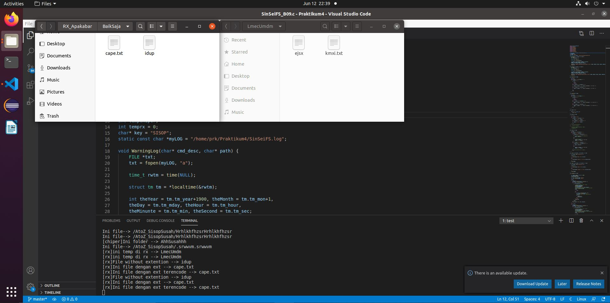
---

#### 2.b)
*Praktikan* diminta untuk membuat filesystem dimana jika sebuah direktori di-rename dengan awalan “RX_”, maka direktori tersebut akan menjadi direktori terencode beserta isinya dengan perubahan nama isi sesuai dengan kasus nomor 1 dengan algoritma tambahan Vigenere Cipher dengan key “SISOP” (Case-sensitive, Atbash + Vigenere).


#### Source Code & Penjelasan
---
```c
void ViginereE(char *temp)
{
    int i = 0;
    int j = 0;
    while (temp[i] != '\0' && temp[i] != '.')
    {  
        if(temp[i] == '/')
        {
            i++;
            j = 0;
            continue;
        }
        else if(temp[i] >= 'A' && temp[i] <= 'Z')
        {
            temp[i] = ((temp[i] - 'A') + (key[j % strlen(key)] - 'A')) % 26 + 'A';
        }
        else if (temp[i] >= 'a' && temp[i] <= 'z')
        {
            temp[i] = ((temp[i] - 'a') + (key[j % strlen(key)] - 'A')) % 26 + 'a';
        }

        j++;
        i++;
    }
}

void ViginereD(char *temp)
{
    int i = 0;
    int j = 0;
    while (temp[i] != '\0' && temp[i] != '.')
    {
        if(temp[i] == '/')
        {
            i++;
            j = 0;
            continue;
        }
        else if (temp[i] >= 'A' && temp[i] <= 'Z')
        {
            temp[i] = ((temp[i] - 'A') - (key[j % strlen(key)] - 'A') + 26) % 26 + 'A';
            j++;
        }
        else if (temp[i] >= 'a' && temp[i] <= 'z')
        {
            temp[i] = ((temp[i] - 'a') - (key[j % strlen(key)] - 'A') + 26) % 26 + 'a';
            j++;
        }
        i++;
    }
}

int crlog2(char *str)
{
    char line[1000];
    
    FILE *fp = fopen("running2.log", "r");

    if(!fp) 
    {
        return 0;
    }

    while (fgets(line, sizeof(line), fp))
    {
        printf("Ini Line --> %s",line);
        printf("ini str --> %s\n",str);
        if (strncmp(line, "[rename]", 8))
        {
            continue;
        }

        line[strcspn(line, "\n")] = '\0';
        char *path = strrchr(line, ' ') + 1;
        char *name = strstr(path, "/RX_");
        printf("ini name --> %s\n",name);

        if (!name)
        {
            continue;
        }

        char name2[1000];
        strcpy(name2, str);

        printf("ini name2 --> %s\n",name2);

        char* temptok1 = strtok(name, "/") ;
        char* temptok2 = strtok(name2, "/");
        printf("ini temptok1 --> %s\n",temptok1);
        printf("ini temptok2 --> %s\n",temptok2);
        if (!strcmp(temptok1, temptok2))
        {
            return 1;
        }
    }

    return 0;
}
char* polapath(char* path)
{
 
    char *fpath = malloc(sizeof(char) * 1000);
    char real_path[1000];
    strcpy(real_path, path);

    char *str = strstr(real_path, "/AtoZ_");
    char *rex = strstr(real_path, "/RX_");

    if(rex)
    {
        temprx = 1;
        int index = strlen(real_path) - strlen(rex) + 1;
        int templog = crlog2(&real_path[index]);
        while (index < strlen(real_path))
        {
            if (real_path[index] == '/')
            {
                if(templog)
                {
                    ViginereD(&real_path[index]);
                    atcip(&real_path[index]);
                }
                else
                {
                    rot13(&real_path[index]);
                    atcip(&real_path[index]);
                }
                
                // printf("ini index --> %d\n ",index);
                char dirp_temp[1000];
                sprintf(dirp_temp, "%s%s", dirp, real_path);
                // printf("Ini folder dengan path --> %s\n",dirp_temp);
                DIR* dp = opendir(dirp_temp);
                if(dp)
                {
                    break;
                }
                else
                {
                    char* file = strrchr(real_path,'/')+1;
                    char* extensi = strchr(file,'.');
                    //printf("Ini file--> %s%s\n",real_path,file);
                    if(extensi)
                    {
                        extensi += 1;
                        atcip(extensi);
                    }
                    break;
                }
                closedir(dp);
            }
            index++;
        }
        sprintf(fpath, "%s%s", dirp, real_path);
    }

    else if (str)
    {
        tempchiper = 1;
        int index = strlen(real_path) - strlen(str) + 1;
        while (index < strlen(real_path))
        {
            if (real_path[index] == '/')
            {
                // printf("ini index --> %d\n ",index);
                atcip(&real_path[index]);
                char dirp_temp[1000];
                sprintf(dirp_temp, "%s%s", dirp, real_path);
                // printf("Ini folder dengan path --> %s\n",dirp_temp);
                DIR* dp = opendir(dirp_temp);
                if(dp)
                {
                    break;
                }
                else
                {
                    char* file = strrchr(real_path,'/')+1;
                    char* extensi = strchr(file,'.');
                    printf("Ini file--> %s%s\n",real_path,file);
                    if(extensi)
                    {
                        extensi += 1;
                        atcip(extensi);
                
                    }
                    break;
                }
                closedir(dp);
            }
            index++;
        }
        sprintf(fpath, "%s%s", dirp, real_path);
    }

    else
    {
        sprintf(fpath, "%s%s", dirp, real_path);
    }
    
    return fpath;
}
```
- Berikut adalah 4 fungsi yang digunakan yakni ViginereE(), ViginereD(),crlog2() dan polapath().
- Viginire E adalah fungsi yang digunakan untuk mengenkripsi dengan cara Viginere.
- Viginire D adalah fungsi yang berguna untuk mendekripsi dengan metode Viginere.
- Sedangkan untuk crlog2(), karena telah membuat log pada nomor 2.d), maka dapat dicek dari log tersebut apakah folder yang dikerjakan berupa rename, apabila iya, maka akan digunakan Atbash Cipher beserta Viginere, apabila tidak maka ROT13 dan Atbash Cipher (Karena mkdir pada nomor 2.a).
- Penjelasan polapath sama seperti nomor 2.a.
#### Output :
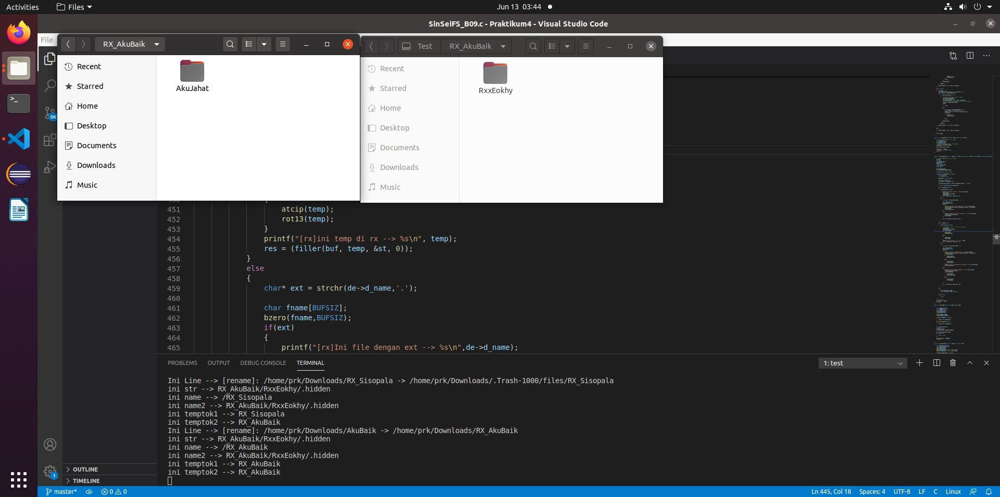
---
#### 2.c)
*Praktikan* diminta untuk membuat filesystem dimana bisa dilakukan rename(perubahan nama folder) dimana apabila direktori yang terenkripsi di-rename menjadi tidak ter-encode, maka isi direktori tersebut akan terdecode.

#### Source Code & Penjelasan
---
```c
...
static int xmp_rename(const char *lama, const char *baru)
{
    char tempsebelum[BUFSIZ];
    char tempsetelah[BUFSIZ];
    clear(tempsebelum);
    clear(tempsetelah);
    sprintf(tempsebelum, "%s%s", dirp, lama);
    sprintf(tempsetelah, "%s%s", dirp, baru);

    rlog(tempsebelum,tempsetelah,1);
    rlog2(tempsebelum,tempsetelah,1);

	int res;

	res = rename(tempsebelum, tempsetelah);
	if (res == -1)
		return -errno;

	return 0;
}
...
```
- Pada fungsi rename seperti pada 2.b), itu juga akan berjalan ketika folder direname menjadi nama yang tidak ter-encode atau terenkripsi, fungsinya telah mampu menghandle kejadian tersebut. Hal ini terjadi karena pada dasarnya Atbash Cipher merupakan pencerminan daripada string. Maka cukup menggunakan algoritma yang telah dijelaskan pada 2.b) pada soal ini. Contoh "AtoZ_APA KABAR" di enkripsi menggunakan Atbash Cipher menjadi "ZKZ PZYZI", begitu pula "ZKZ PZYZI" di atbash menjadi "APA KABAR", kemudian hal yang sama akan terjadi untuk rot13 cipher begitu pula untuk Viginere.

#### Output :
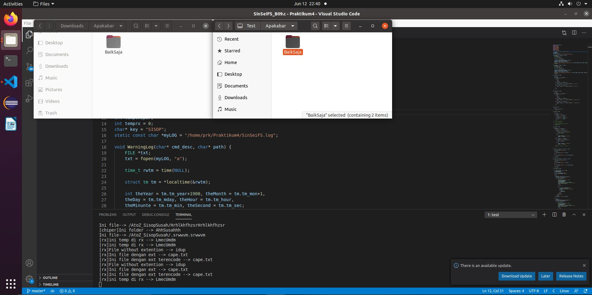
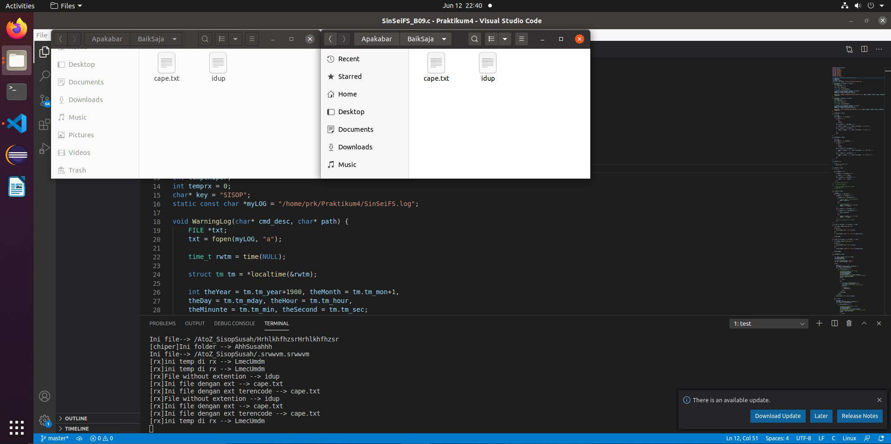
---
#### 2.d)
*Praktikan* diminta untuk membuat filesystem dimana bisa setiap pembuatan direktori ter-encode (mkdir atau rename) akan tercatat ke sebuah log.

#### Source Code & Penjelasan
```c
void rlog2 (char dir_lama[], char dir_baru[], int tipe)
{
    FILE* logge2 = fopen("running2.log","a");
 
    if(tipe == 0)
    {
        fprintf(logge2,"[mkdir]: %s\n", dir_baru);
    }
    else
    {
        fprintf(logge2,"[rename]: %s -> %s\n", dir_lama,dir_baru);
    }
 
    fclose(logge2);
}
```
- Pada soal ini, diminta membuat log untuk setiap mkdir(pembuatan folder) dan rename(penggantian nama folder). Caranya adalah dengan menambahkan fungsi rlog() dimana tujuan dari fungsi ini adalah membuka file `running2.log` ( membuatnya ketika belum ada ) pada path dimana dia akan diletakkan
- Setelah itu ketika pada source code fungsi xmp_mkdir dan xmp_rename diatas, dapat dilihat bahwa ditambahkan rlog() dengan parameter nama filenya serta modenya. Disini, ditentukan bahwa mode `0` berarti mkdir dan mode `1` berarti rename, sehingga nantinya dapat dihandle oleh rlog ketika diketahui modenya. Apabila modenya `0` maka akan dilakukan `fprintf(logge2,"[mkdir]: %s\n", dir_baru);`, apabila mode `1` maka akan menjadi `fprintf(logge2,"[rename]: %s -> %s\n", dir_lama,dir_baru);`.
- Terakhir adalah menutup file dengan `fclose`.
#### Output :
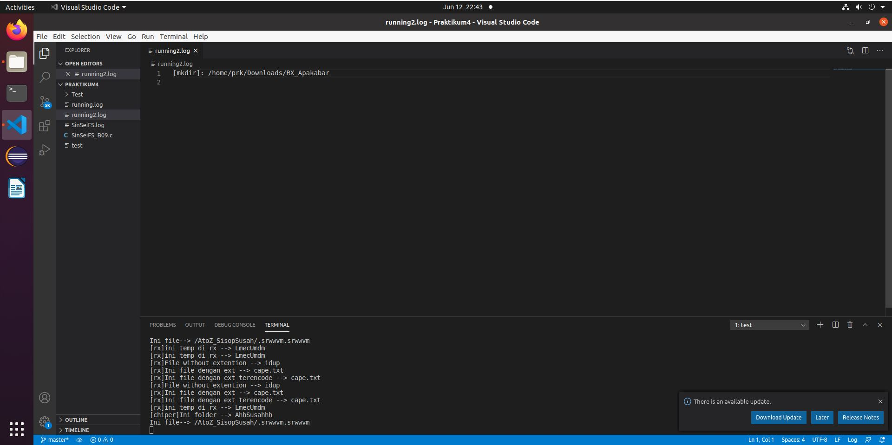
---
#### Kendala
---
- Nomor 2.e) sangat sulit tanpa adanya exec()
- Kesulitan nomor 2.b) mencari ide bagaimana mengecek apakah rename atau mkdir
- Waktu yang diberikan terlalu cepat
---
### Soal 4
*Praktikan* diminta dapat membuat log system.

#### 4a)
Log system yang akan terbentuk bernama “SinSeiFS.log” pada direktori home pengguna (/home/[user]/SinSeiFS.log). Log system ini akan menyimpan daftar perintah system call yang telah dijalankan pada filesystem.
#### Source Code :
```c
static const char *myLOG = "/home/prk/SinSeiFS.log";
```

#### 4b)
Karena Sin dan Sei suka kerapian maka log yang dibuat akan dibagi menjadi dua level, yaitu **INFO** dan **WARNING**.
#### Source Code :
- Warning
```c
void WarningLog(char* cmd_desc, char* path) {
    FILE *txt;
    txt = fopen(myLOG, "a");
 
    time_t rwtm = time(NULL);
 
    struct tm tm = *localtime(&rwtm);
 
    int theYear = tm.tm_year+1900, theMonth = tm.tm_mon+1,
    theDay = tm.tm_mday, theHour = tm.tm_hour,
    theMinunte = tm.tm_min, theSecond = tm.tm_sec;
 
    fprintf(txt, "WARNING::%02d%02d%02d-%02d:%02d:%02d::%s::%s\n", theDay, theMonth, theYear, theHour, theMinunte, theSecond, cmd_desc, path);
    fclose(txt);
}
```
- Info
```c
void InfoLog(char* cmd_desc, char* path) {
    FILE *txt;
    txt = fopen(myLOG, "a");
 
    time_t rwtm = time(NULL);
 
    struct tm tm = *localtime(&rwtm);
 
    int theYear = tm.tm_year+1900, theMonth = tm.tm_mon+1,
    theDay = tm.tm_mday, theHour = tm.tm_hour,
    theMinunte = tm.tm_min, theSecond = tm.tm_sec;
 
    fprintf(txt, "INFO::%02d%02d%02d-%02d:%02d:%02d::%s::%s\n", theDay, theMonth, theYear, theHour, theMinunte, theSecond, cmd_desc, path);
    fclose(txt);
}
```
#### Penjelasan :
- Pada `txt = fopen(myLOG, "a")` merupakan fungsi untuk membuka file SinSeiFS.log.
- `time_t` dan `struct tm` gunanya untuk mendapatkan waktu yang ada pada komputer.
- `rwtm = time(NULL)` gunanya untuk mengkalkulasi waktu kalender sekarang dan disimpan ke dalam rwtm.
- `tm = *localtime(&rwtm)` gunanya untuk memasukkan nilai dari rwtm ke format `struct tm tm`.
- Lalu akan di print dengan sesuai format `    fprintf(txt, "INFO::%02d%02d%02d-%02d:%02d:%02d::%s::%s\n", theDay, theMonth, theYear, theHour, theMinunte, theSecond, cmd_desc, path);`

#### 4c)
Untuk log level **WARNING**, digunakan untuk mencatat syscall **rmdir** dan **unlink**.
#### Source Code :
- rmdir
```c
static int xmp_rmdir(const char *path) {
    char fpath[1000];
    if (strcmp(path, "/") == 0) 
    {
            path = dirp;
            sprintf(fpath, "%s", path);
        } else {
        sprintf(fpath, "%s%s", dirp, path);
    }
 
    int res;
    res = rmdir(fpath);
    if (res == -1) return -errno;
 
    WarningLog("RMDIR", fpath);
 
    return 0;
}
```
- unlink
```c
	static int xmp_unlink(const char *path) {
	    char fpath[1000];
	 
	    if (strcmp(path, "/") == 0) {
	            path = dirp;
	            sprintf(fpath, "%s", path);
	        } else {
	        sprintf(fpath, "%s%s", dirp, path);
	    }
	 
	    int res;
	    res = unlink(fpath);
	    if (res == -1) return -errno;
	 
	    WarningLog("UNLINK", fpath);
	 
	    return 0;
	}
```

#### 4d)
sisanya dicatat pada **info**
- getattr : mendapatkan informasi atribut dari file atau direktori
```c
static int xmp_getattr(const char *path, struct stat *stbuf) {
    int res;
    char fpath[1000];
 
	sprintf(fpath, "%s%s", dirpath, path);
 
	res = lstat(fpath, stbuf);
 
	if(res == -1) return -errno;
 
	InfoLog("LS", fpath);
   	return 0;
}
```
- readdir : membaca dan membuka stream dari direktori
```c
static int xmp_readdir(const char *path, void *buf, fuse_fill_dir_t filler, off_t offset, struct fuse_file_info *fi) {
    	char fpath[1000];
 
    	if(strcmp(path, "/") == 0) 
		{
        	path = dirpath;
        	sprintf(fpath, "%s", path);
    	} 
		else 
		{
		sprintf(fpath, "%s%s", dirpath, path);
		}
 
	int res = 0;
 
   	DIR *dp;
    struct dirent *de;
	(void) offset;
    (void) fi;
 
	dp = opendir(fpath);
 
    if(dp == NULL) return -errno;
 
   	while ((de = readdir(dp)) != NULL) {
        	struct stat st;
 
	        memset(&st, 0, sizeof(st));
 
        	st.st_ino = de->d_ino;
        	st.st_mode = de->d_type << 12;
 
			if(res!=0) break;
		}
 
	closedir(dp);
	InfoLog("CD", fpath);
	return 0;
}
```
- write : untuk melakukan writing pada file atau direktori
```c
static int xmp_write(const char *path, const char *buf, size_t size, off_t offset, struct fuse_file_info *fi) {
	char fpath[1000];
 
	if (strcmp(path, "/") == 0) {
        	path = dirpath;
        	sprintf(fpath, "%s", path);
    	} else {
		sprintf(fpath, "%s%s", dirpath, path);
	}
 
    int fd;
	int res;
 
	(void) fi;
	fd = open(fpath, O_WRONLY);
	if (fd == -1) return -errno;
 
	res = pwrite(fd, buf, size, offset);
	if (res == -1) res = -errno;
 
	close(fd);
 
    	// logs(0, "WRITE", fpath, "");
	InfoLog("WRITE", fpath);
	return res;
}
```
- rename : mengganti nama dari file atau direktori
```c
static int xmp_rename(const char *from, const char *to) {
	char src[1000], dst[1000];
 
	if (strcmp(from, "/") == 0) {
        	from = dirpath;
        	sprintf(src, "%s", from);
    	} else {
		sprintf(src, "%s%s", dirpath, from);
	}
 
	if (strcmp(to, "/") == 0) {
        	to = dirpath;
        	sprintf(dst, "%s", to);
    	} else {
		sprintf(dst, "%s%s", dirpath, to);
	}
 
	int res;
	res = rename(src, dst);
	if (res == -1) return -errno;
 
	InfoLog("RENAME", src);
 
	return 0;
}
```

- open : membuka sebuah file atau direktori
```c
static int xmp_open(const char *path, struct fuse_file_info *fi) {
	char fpath[1000];
 
	if (strcmp(path, "/") == 0) {
	        path = dirpath;
	        sprintf(fpath, "%s", path);
    	} else {
		sprintf(fpath, "%s%s", dirpath, path);
	}
 
	int res;
	res = open(fpath, fi->flags);
	if (res == -1) return -errno;
 
	close(res);
 
	InfoLog("OPEN", fpath);
 
	return 0;
}
```
- mknod : untuk mengetahui permission dari file
```c
static int xmp_mknod(const char *path, mode_t mode, dev_t rdev) {
	char fpath[1000];
 
	if (strcmp(path, "/") == 0) {
        	path = dirpath;
        	sprintf(fpath, "%s", path);
    	} else {
		sprintf(fpath, "%s%s", dirpath, path);
	}
 
	int res;
	if (S_ISREG(mode)) {
		res = open(fpath, O_CREAT | O_EXCL | O_WRONLY, mode);
		if (res >= 0) {
			res = close(res);
		}
	} else if (S_ISFIFO(mode)) {
		res = mkfifo(fpath, mode);
	} else {
		res = mknod(fpath, mode, rdev);
	}
 
	if (res == -1) return -errno;
	InfoLog("CREATE", fpath);
	return 0;
}
```


- mkdir : untuk membuat direktori
```c
static int xmp_mkdir(const char *path, mode_t mode) {
	char fpath[1000];
	if (strcmp(path, "/") == 0) {
        	path = dirpath;
        	sprintf(fpath, "%s", path);
    	} else {
		sprintf(fpath, "%s%s", dirpath, path);
	}
 
	int res;
	res = mkdir(fpath, 0750);
	if (res == -1) return -errno;
 
	InfoLog("MKDIR", fpath);
```

#### 4e)
Format untuk logging yaitu:

[Level]::[dd][mm][yyyy]-[HH]:[MM]:[SS]:[CMD]::[DESC :: DESC]

Level : Level logging, dd : 2 digit tanggal, mm : 2 digit bulan, yyyy : 4 digit tahun, HH : 2 digit jam (format 24 Jam),MM : 2 digit menit, SS : 2 digit detik, CMD : System Call yang terpanggil, DESC : informasi dan parameter tambahan

INFO::28052021-10:00:00:CREATE::/test.txt
INFO::28052021-10:01:00:RENAME::/test.txt::/rename.txt

#### Output :
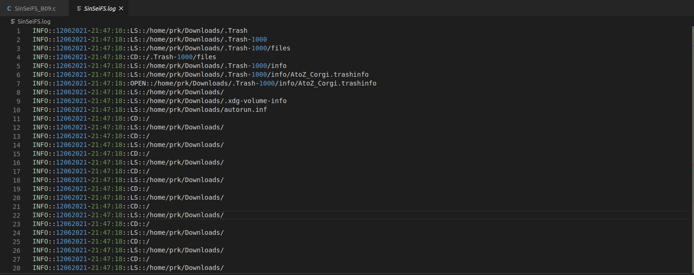
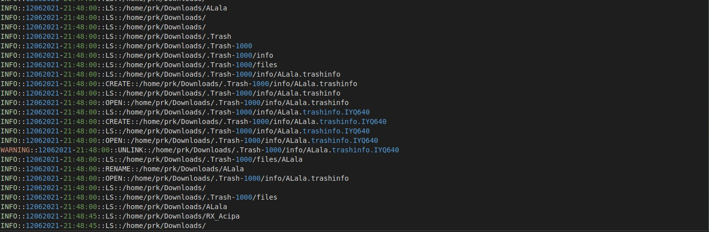

#### Kendala :
